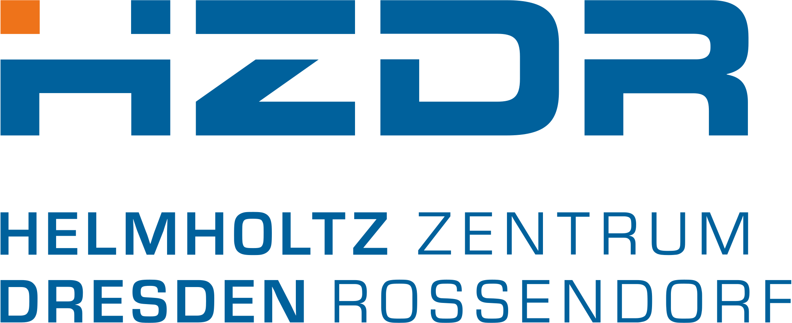

# terok

> [!WARNING]
> This documentation was written by an AI agent and might be inaccurate.

An open, Podman-native runtime for AI coding agents you can let off
the leash — without giving them the leash to your machine.

terok runs each agent task inside a hardened, rootless container with
default-deny outbound networking, a credential vault that keeps real
keys on the host, a per-task git checkpoint, and a desktop
notification path for live allow/deny decisions.  It ships a CLI
and a Textual TUI on top of a focused stack of independently-released
Python packages.


## Acknowledgements

<table border="0" style="border: none;">
<tr style="border: none;">
<td valign="top" style="border: none;">
<a href="https://www.casus.science"></a>
<br>
<a href="https://www.hzdr.de"></a>
</td>
<td valign="top" style="border: none;">
Terok was started at the
<br><a href="https://www.casus.science/">Center for Advanced Systems Understanding (CASUS)</a>, an institute of
<br><a href="https://www.hzdr.de/">Helmholtz-Zentrum Dresden-Rossendorf (HZDR)</a> at the end of 2025.
<br>
<br>See also
<br><a href="https://helmholtz.software/software/terok">Terok at HELMHOLTZ.software</a> and the
<br><a href="https://www.casus.science/scientific-computing-core-agentic-ai-for-coding/">topic page</a> at the
<br><a href="https://www.casus.science/scientific-computing-core/">Scientific Computing Core (SCC) group</a> of CASUS.
</td>
</tr>
</table>

## What you get

### Hardening

- **Rootless Podman** — no daemon, no privileged user namespace
- **Default-deny egress firewall** with curated allowlist profiles
  and per-container audit logs (via
  [terok-shield](https://github.com/terok-ai/terok-shield))
- **Credential vault** — secrets stay on the host
- **Per-task git gate** — a git mirror that the agent pushes through,
  giving you a human-review point before changes leave your machine
- **Live Allow / Deny prompts** — desktop notifications on blocked
  outbound traffic, turned into immediate firewall rules

### Workflow

- **Projects ⊃ Tasks** — long-lived project config, ephemeral task
  containers; many tasks per project
- **Headless / interactive / web interface** — pick the launch mode
  per task; same agents, same hardening
- **Layered images** — base distro · agent CLIs · per-project
  snippet, cached and reused across projects; Ubuntu / Debian /
  Fedora / nvidia/cuda out of the box, GPU passthrough (NVIDIA / AMD /
  Intel) for projects whose base image supports it
- **Sickbay + panic** — health checks with auto-remediation and an
  emergency kill-switch
- **Multi-vendor agents** — Claude Code, Codex, Copilot, Vibe, plus
  custom LLM endpoints via OpenCode (Helmholtz, university, or your
  own endpoint — bundled defaults included)

## Quick Start

### Prerequisites

- **Podman** (rootless) and **`nft`** (nftables CLI) — the two hard
  dependencies
- **Python 3.12+**
- **OpenSSH client** — for private git repos
- Optional but recommended: **systemd** user session, **`dnsmasq`**
  and **`dig`** (DNS plumbing for the egress firewall), a desktop
  **notification daemon**

### Installation

```bash
pipx install terok
```

### One-time setup

```bash
terok setup
```

`setup` installs the supervisor + shield OCI hooks, sets up the encrypted
credential store and its vault routes, and adds the XDG desktop entry for
the TUI plus shell completions for your detected shell.  The per-container
services (vault, gate, clearance) are started on demand by the supervisor
at task launch.  Idempotent — safe to re-run.

Interactive runs prompt for where the credentials-DB passphrase is
stored; the TUI collects the same choice in its setup dialogs before
dispatching.  Non-interactive hosts without systemd-creds must choose
with `terok setup --passphrase-tier <keyring|session-file|config>`.

### First project

Launch the TUI:

```bash
terok                                   # bare `terok` on a TTY runs the TUI
```

- Press **n** to run the project wizard (creates config, builds images, sets up SSH + gate)
- Select your new project, press **a** to authenticate your agent
- Press **t** to start a task (CLI, Toad, or unattended)

Or do the same from the command line:

```bash
terok auth claude                       # authenticate host-wide
terok project wizard                    # interactive project setup
terok task run myproj                   # create a CLI task and attach (default on TTY)
terok task run myproj --mode toad       # web interface (browser access)
terok login myproj v9k                  # re-attach later by task ID prefix
```

For manual project configuration or CI, see the [User Guide](usage.md).

### Headless Agent Runs (Unattended)

```bash
# Run an agent headlessly with a prompt
terok task run myproj --mode headless --prompt "Fix the authentication bug"

# With model override and timeout
terok task run myproj --mode headless --prompt "Add tests" --model opus --timeout 3600

# Use a specific agent
terok task run myproj --mode headless --prompt "Fix the bug" --agent codex
```

## Documentation

- [Concepts](concepts.md) — Architecture, security model, and design rationale
- [User Guide](usage.md) — Complete user documentation
- [Container Layers](container-layers.md) — Container image architecture
- [Container Lifecycle](container-lifecycle.md) — Container and image lifecycle
- [Shared Directories](shared-dirs.md) — Volume mounts and vault
- [Security Modes](git-gate-and-security-modes.md) — Online vs gatekeeping modes
- [Shield](shield-security.md) — Egress firewall (terok-shield)
- [Agent Compatibility Matrix](agent-compat-matrix.md) — Per-agent feature support
- [Login Design](login-design.md) — Login session architecture
- [Docker](docker.md) — Running terok inside Docker (experimental)
- [Developer Guide](developer.md) — Architecture and contributing
- [API Reference](reference/) — Auto-generated API documentation

## License

See [LICENSE](https://github.com/terok-ai/terok/blob/master/LICENSE) file.
